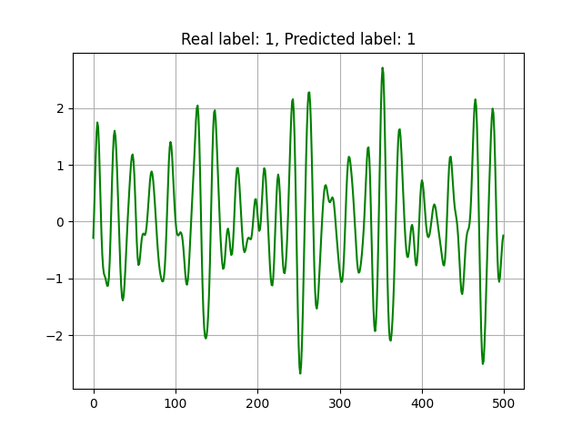
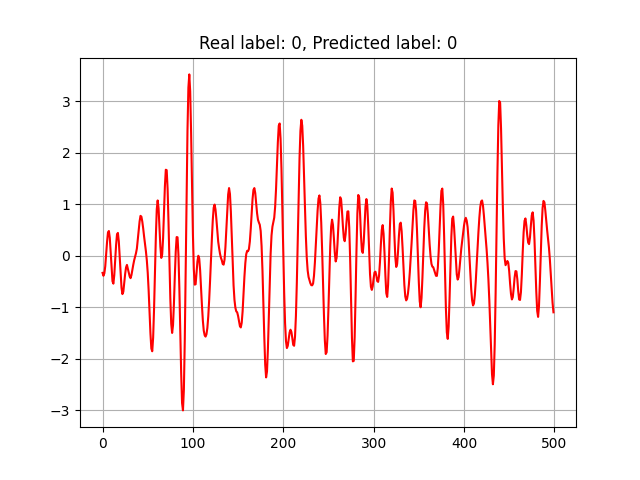

# ROCKET
A prototype implementation for ROCKET -  Exceptionally fast and accurate time series classification using random convolutional kernels https://arxiv.org/abs/1910.13051


## Installation
Build an environment:
```bash
virtualenv venv
source venv/bin/activate
pip3 install -r requirements
```

## Training
In order to train the model, run:
```bash
python3 train.py
```
## Testing
Testing the trained can be done by running:
```bash
python3 test.py
```
The script will choose the best model from the trained models folder, will sample a series from the dataloader, predict the class and plot it

## Prediction Results:


